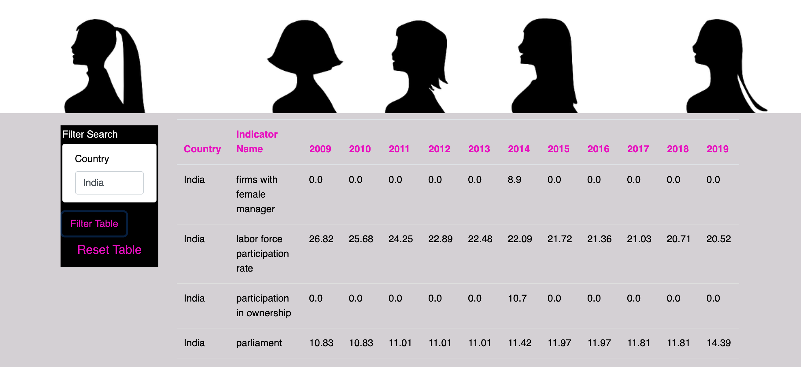
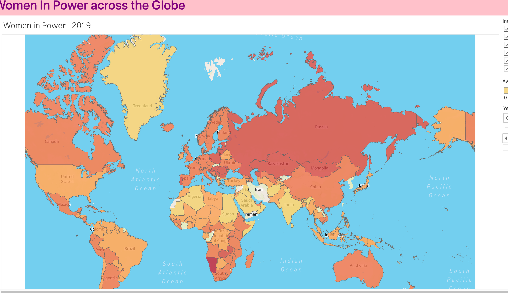

### Women-in-Power
 
This project was created for the Northwestern Data Science Bootcamp as a final project.   As a team, we selected a database that reflected the percentages of women in power globally that had parliamentary forms of government.  We compared the dataset to another dartaset from the same source  that contained information on equality clauses within a specific country's constitution and other quotas that could affect the percentages reported of women in management,the labor force, woman owned businesses, and corporate board quotas. We invite you to look into our findings on the following pages. 
 
 
 Team Members:
    Corrine Ptacek,
    Lisa Weinstein,
    Katie Young,
    Manisha Shetti,
    Liliana Ilut

